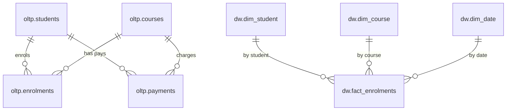

## University Data ETL & Warehouse Prototype

This project simulates a **university data pipeline** and **star-schema data warehouse** for analytics. It is designed as a portfolio-ready project you can run locally with PostgreSQL and talk about in interviews.

### Features

- **Raw CSV data sources** for students, courses, enrolments, and payments.
- **OLTP schema** for loading cleaned operational data.
- **Star-schema data warehouse** with one fact and several dimension tables.
- **Python ETL pipeline** to extract, transform, and load data into Postgres.
- **Analytical SQL** queries demonstrating joins, aggregations, and window functions.

### Tech Stack

- **Language**: Python 3.10+
- **Database**: PostgreSQL (local or managed)
- **Libraries**: `pandas`, `psycopg2-binary`, `python-dotenv` (for local env config)

---

## 1. Data Model

### 1.1 OLTP Schema (`oltp` schema)

- **`oltp.students`**
  - `student_id` (PK)
  - `first_name`
  - `last_name`
  - `date_of_birth`
  - `gender`
  - `country`
  - `created_at`

- **`oltp.courses`**
  - `course_id` (PK)
  - `course_code`
  - `course_name`
  - `department`
  - `credit_points`
  - `level` (e.g. Undergraduate/Postgraduate)
  - `created_at`

- **`oltp.enrolments`**
  - `enrolment_id` (PK)
  - `student_id` (FK -> `oltp.students`)
  - `course_id` (FK -> `oltp.courses`)
  - `enrolment_date`
  - `semester` (e.g. 2025S1)
  - `status` (e.g. ENROLLED/WITHDRAWN/COMPLETED)

- **`oltp.payments`**
  - `payment_id` (PK)
  - `student_id` (FK -> `oltp.students`)
  - `course_id` (FK -> `oltp.courses`)
  - `payment_date`
  - `amount`
  - `payment_method` (e.g. CARD/BANK_TRANSFER)

### 1.2 Data Warehouse Star Schema (`dw` schema)

- **Fact table: `dw.fact_enrolments`**
  - `fact_enrolment_id` (PK)
  - `student_key` (FK -> `dw.dim_student`)
  - `course_key` (FK -> `dw.dim_course`)
  - `date_key` (FK -> `dw.dim_date`)
  - `enrolment_id` (business key from `oltp.enrolments`)
  - `payment_amount`
  - `enrolment_status`
  - `semester`

- **Dimension table: `dw.dim_student`**
  - `student_key` (PK surrogate)
  - `student_id` (business key, from OLTP)
  - `full_name`
  - `gender`
  - `country`
  - `age_at_enrolment` (optional, can be derived per fact row)

- **Dimension table: `dw.dim_course`**
  - `course_key` (PK surrogate)
  - `course_id` (business key)
  - `course_code`
  - `course_name`
  - `department`
  - `credit_points`
  - `level`

- **Dimension table: `dw.dim_date`**
  - `date_key` (PK, integer like YYYYMMDD)
  - `date_actual` (date)
  - `day`
  - `month`
  - `year`
  - `month_name`
  - `quarter`

#### 1.3 ER Diagram (Conceptual)

You can paste the following into a tool that supports Mermaid to visualise the model:



---

## 2. Project Structure

Expected layout:

```text
university-etl/
  README.md
  requirements.txt
  schema.sql
  etl.py
  analytics_queries.sql
  .env.example
  data/
    raw/
      students.csv
      courses.csv
      enrolments.csv
      payments.csv
```

---

## 3. Getting Started

### 3.1 Prerequisites

- Python 3.10+
- PostgreSQL running locally or on a remote host

Create a database in Postgres, for example:

```sql
CREATE DATABASE university_etl;
```

### 3.2 Install Dependencies

From the `university-etl` directory:

```bash
python -m venv .venv
source .venv/bin/activate  # Windows: .venv\Scripts\activate
pip install -r requirements.txt
```

### 3.3 Configure Database Connection

Copy `.env.example` to `.env` and fill in your Postgres details:

```bash
cp .env.example .env
```

Environment variables:

- `DB_HOST`
- `DB_PORT`
- `DB_NAME`
- `DB_USER`
- `DB_PASSWORD`

The ETL script will read these via `python-dotenv`.

### 3.4 Initialise Schema and Load Data

The ETL script will:

- Create `oltp` and `dw` schemas and tables (idempotent).
- Load CSVs from `data/raw` into the OLTP tables.
- Populate dimension tables.
- Populate the `fact_enrolments` fact table.

Run:

```bash
python etl.py
```

If everything is configured correctly you should see log output for each stage.

---

## 4. Running Analytics Queries

After the ETL has completed, you can run the queries in `analytics_queries.sql` against your Postgres database. They demonstrate:

- **Total enrolments per semester**
- **Revenue per course**
- **Average student load**
- **Monthly revenue trends**
- **Top 5 courses by revenue**
- **Example window functions** (e.g. ranking courses by revenue)

You can execute them using any SQL client or `psql`:

```bash
psql -d university_etl -f analytics_queries.sql
```

---

## 5. Talking About This Project

You can describe this project in applications and interviews as:

> I developed a prototype ETL pipeline simulating a university data warehouse, including automated extraction and transformation of CSV-based operational data into PostgreSQL, a star-schema warehouse with fact and dimension tables, and analytical SQL reporting for enrolment and revenue insights.

Suggested resume entry:

- **University Data Warehouse ETL Prototype (Personal Project)**  
  - Designed relational and dimensional data models for simulated university datasets (students, courses, enrolments, payments).  
  - Developed automated Python ETL pipeline to extract, transform, and load CSV data into PostgreSQL.  
  - Built a star-schema warehouse with fact and dimension tables to support analytical reporting.  
  - Wrote complex SQL queries (joins, aggregations, window functions) to generate enrolment, revenue, and growth insights.  
  - Documented architecture and data flow using Git version control and markdown.

